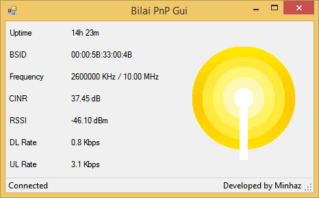

# Bilai PnP Gui

Forget web based control panel for Bilai (Banglalion) devices.

```
This is a fun project. I have no affiliation/contract with Banglalion Communications Ltd. Use at your own risk.
```

This app logs in to web based control panel using HttpRequest, fetches device status data, parses them and shows as desktop application.

## Downloads

* [Windows](https://github.com/minhazul-haque/Bilai-PnP-Gui/releases/download/1.0.0/Windows-Bilai-PnP-Gui.exe)
* Linux [TODO](link)
* MacOSX [TODO](link)

## Screenshots



### TODO

* Add check when device is unplugged
* Add more state info, ie. disconnected, ranging etc.
* Show more info like mac address, version etc.
